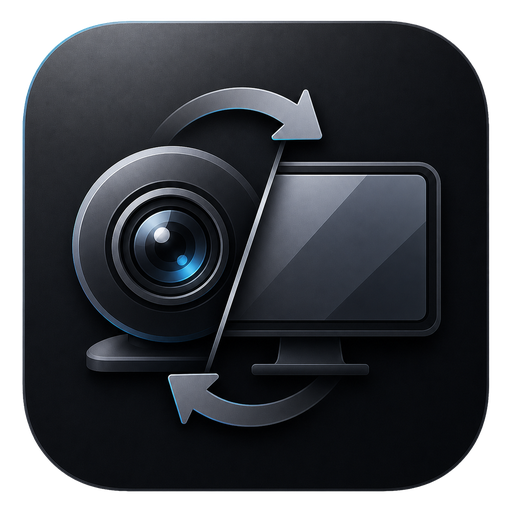

<p align="center">
  
</p>

<h1 align="center">StageSwap</h1>

<p align="center">
  <strong>Stay present while you present.</strong><br>
  StageSwap automatically switches your virtual camera between you and your screen during hybrid meetings.
</p>

<p align="center">
  <a href="https://github.com/NatanSlvdr/StageSwap/releases/latest"><strong>Download for Windows 11</strong></a>
  ·
  <a href="#how-automatic-mode-works">How it works</a>
  ·
  <a href="DEV.md">Developer guide</a>
</p>

---

## One camera that knows when you are presenting

StageSwap combines **one webcam** and **one display** into a single virtual camera. Choose **StageSwap** as the camera in your meeting app and leave it selected: StageSwap decides whether that camera feed should currently show you or your presentation.

When your chosen display shows its saved idle view, people see your webcam. Change the display to your presentation and they see the screen. Return to the idle view and StageSwap brings you back on camera.

> [!IMPORTANT]
> StageSwap sends the display through a virtual **camera** at 1280×720 and 30 fps. It does not start your meeting app's native screen-sharing mode and it does not send audio.

## How Automatic mode works

### 1. You choose an idle view

Show something recognizable on your presentation display: a holding slide, event graphic, desktop wallpaper, or any screen you use when you want the audience to see you. Select **Capture reference** to save that view. You can also import an existing image.

The reference is simply a visual signal. StageSwap does not read slide titles, app names, or window content.

### 2. StageSwap watches for a change

While automation is running, StageSwap compares the selected display with the reference four times per second.

| What StageSwap detects | What it does |
|:---|:---|
| The display matches the reference | Shows the **webcam** |
| The display no longer matches | Shows the **screen** |
| The reference appears again | Returns to the **webcam** |

StageSwap waits for several matching or different checks before changing the output. With the default settings, a changed screen is recognized in about **0.75 seconds**, while a returned reference is confirmed in about **1.25 seconds**. This avoids rapid switching caused by a cursor, animation, or one unusual frame.

The **Match strictness** setting controls how closely the screen must resemble the saved image. A higher value requires a closer match.

### 3. The output changes smoothly

Every switch uses a half-second fade instead of a hard cut. The fade is reversible: if the detected state changes while a transition is still happening, StageSwap smoothly turns back from its current position.

The final output keeps its 16:9 shape. Sources that do not fit are scaled without stretching and may receive black bars. The webcam can optionally be cropped and centered to fill 16:9.

## Three output modes

The selected mode controls the output while automation is running.

| Mode | Behavior |
|:---|:---|
| **Automatic** | Uses the saved reference to choose between the webcam and screen |
| **Webcam** | Keeps the webcam visible, ignoring reference changes |
| **Screen** | Keeps the selected display visible, ignoring reference changes |

The Webcam and Screen modes are manual overrides. They remain active until you select another mode, and they use the same smooth fade as Automatic mode.

## What happens when something is unavailable?

StageSwap favors predictable, private behavior rather than showing an unexpected source.

| Situation | Output behavior |
|:---|:---|
| No usable reference | Automatic mode stays on the **webcam** |
| Selected display is unavailable | StageSwap falls back to the **webcam** when possible |
| Webcam is unavailable when requested | StageSwap shows a safe placeholder instead of another screen |
| Automation is stopped | The virtual camera shows a black branded StageSwap screen |
| StageSwap is fully exited | Camera apps still receive the black branded StageSwap screen |

If a webcam or display is unplugged, reconnected, or affected by sleep, reselect it or use the restart controls in **Settings → Diagnostics**. StageSwap does not silently replace a missing webcam with a different camera.

## Displays, references, and rescanning

StageSwap remembers the selected display by its Windows name. If that display is no longer available at launch, it prefers another secondary display and uses the main display only when it is the sole option.

By default, StageSwap looks for the saved reference at startup, after the reference changes, and every 30 seconds. It only moves to the best-matching display after confirming the result twice, without pausing the camera output. You can disable automatic display rescans or start one at any time with **Rescan screens**.

You can decide whether the mouse cursor is included in the captured screen and in newly captured references.

## Features at a glance

- **Automatic camera-to-screen switching** based on a reference image you control
- **Webcam and Screen overrides** available from the dashboard and system tray
- **Smooth, reversible transitions** between live sources
- **Four live previews** for the webcam, display, saved reference, and final audience output
- **Component health indicators** for the webcam, screen capture, matching, and virtual camera
- **Display rediscovery** when the reference moves to another monitor
- **Optional 16:9 webcam crop** and optional mouse cursor capture
- **Close to system tray** while capture and output continue running
- **Flexible startup** with start minimized, start automatically, and start with Windows options
- **Built-in recovery controls** to restart the webcam, screen capture, virtual camera, or everything
- **Local diagnostic logs** retained for 14 days, with open, export, and clear actions
- **Local-only processing** with no frame recording or upload

## Everyday app behavior

- **Start automation** makes the selected mode live through the virtual camera.
- **Stop automation** keeps the virtual camera available but replaces its content with the branded off screen.
- Closing the window can leave StageSwap running in the system tray, so the meeting output continues.
- Fully exiting StageSwap stops capture and processing. The registered virtual camera remains available and shows the branded off screen.
- Opening the installed app again brings the existing dashboard back instead of starting a second copy.
- Opening a newer downloaded build offers to update the installed copy while keeping settings and the saved reference.

## Get started

### What you need

- A 64-bit Windows 11 computer
- A webcam
- The display you want to present

### Set up StageSwap

1. Download the latest `StageSwap_win64_vX.Y.Z.exe` from the [official releases page](https://github.com/NatanSlvdr/StageSwap/releases/latest).
2. Open it and choose **Install StageSwap** for the recommended setup, or **Run once** to try it without copying the app to your computer.
3. Approve the Windows administrator prompt on first launch. StageSwap only needs it to add its virtual camera; normal launches do not require administrator access.
4. In StageSwap, choose your webcam and the display you want it to watch.
5. Show your preferred idle view and select **Capture reference**.
6. In your meeting app, choose **StageSwap** as your camera, then select **Start automation**.

> [!NOTE]
> Current releases are unsigned, so Windows may show a security warning. Only continue when the file came from the official StageSwap releases page.

## Install, update, or try it once

StageSwap comes as one self-contained file — there is no traditional setup wizard.

- **Install StageSwap** adds Start Menu and Desktop shortcuts and enables the option to start with Windows.
- **Run once** opens the downloaded copy without installing it. Windows startup stays disabled so moving or deleting the download cannot break it.
- **Update StageSwap** by opening a newer downloaded version. StageSwap asks before replacing the installed copy, keeps your settings, and opens the updated dashboard.

The first launch may briefly request administrator permission. Later launches run normally without it.

## Privacy

StageSwap is local-only. Camera and screen frames stay on your computer and are not recorded or uploaded. Settings, your reference image, and short diagnostic logs are stored under `%LocalAppData%\StageSwap`.

Remember that anything visible on your selected display can become the virtual-camera output while **Automatic** or **Screen** mode is active.

## Removing StageSwap

Exit StageSwap from its system-tray menu first. Then open PowerShell in the folder containing your downloaded StageSwap file and run:

```powershell
.\StageSwap_win64_vX.Y.Z.exe --uninstall
```

This removes the installed app, its shortcuts, Windows startup entry, and virtual camera. Your settings, reference image, and logs are kept. To remove only the startup entry and virtual camera while keeping the installed app, use `--cleanup` instead.

## Need a hand?

If a webcam or display was unplugged, rearranged, or stopped after sleep, reopen StageSwap and choose the source again. The **Diagnostics** settings also provide restart controls for the webcam, screen, and virtual-camera output.

For bugs and feature requests, [open an issue](https://github.com/NatanSlvdr/StageSwap/issues). If you want to build or contribute to StageSwap, continue with the [developer guide](DEV.md).

---

<p align="center">
  <sub>Built for Windows 11 · 1280×720 at 30 fps · Local-only</sub>
</p>
