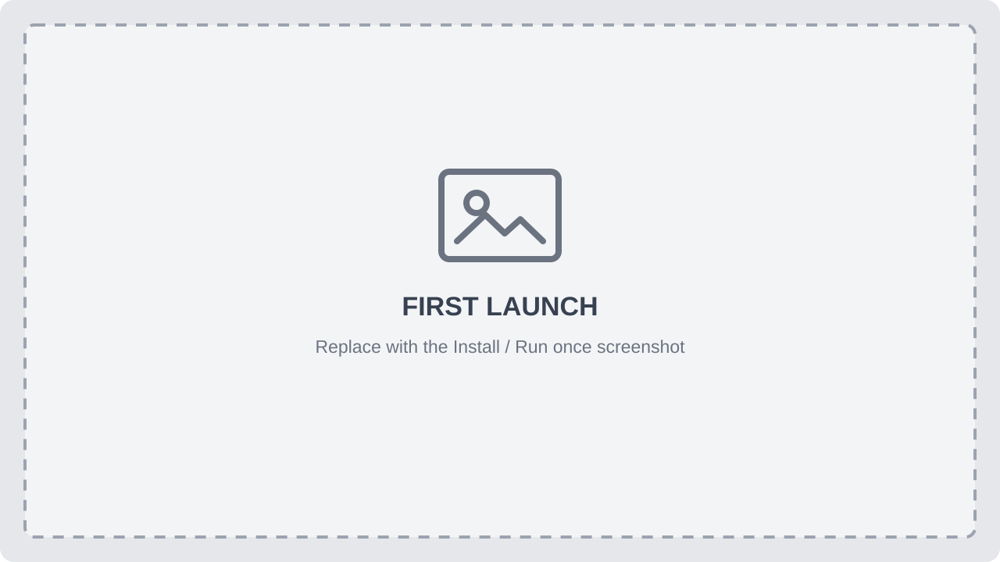
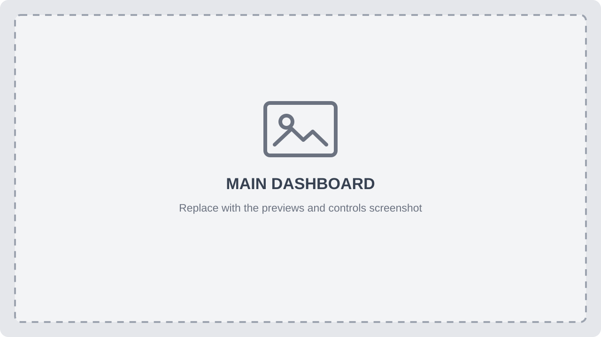
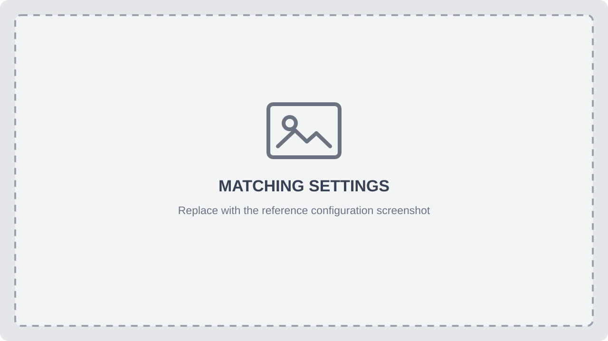
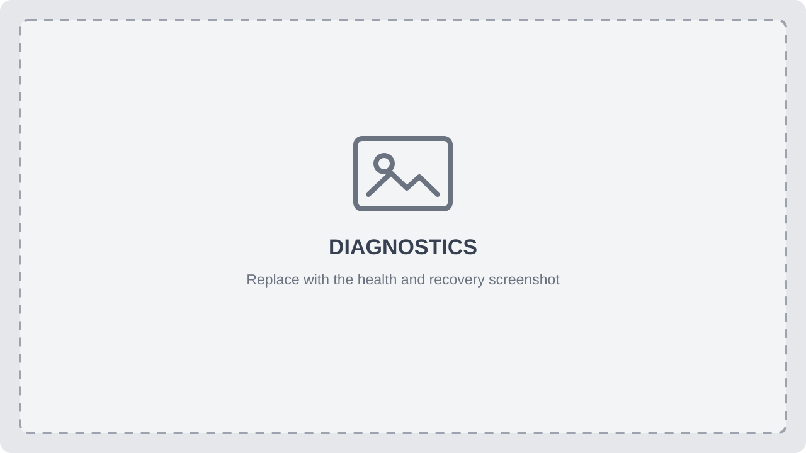

<p align="center">
  
</p>

<h1 align="center">StageSwap</h1>

StageSwap is a free Windows 11 tool built for automatic Zoom retransmission during congregation meetings using JW Library. It combines a webcam and the second display used by JW Library into one virtual camera for Zoom.

The virtual-camera output is fixed at 1280×720 and 30 fps. StageSwap watches the selected display visually; it does not integrate with or control JW Library. It does not start Zoom's native screen-sharing mode and does not transmit audio.

> [!IMPORTANT]
> StageSwap is an independent, unofficial project and is not affiliated with or endorsed by the publisher of JW Library. The name JW Library is used only to describe compatibility.

## How Automatic mode works

Automatic mode uses a saved image of the normal JW Library idle display—the view with centered text and a gray square in the corner—to decide which source Zoom should see. This saved image is called the **idle reference**.

<p align="center"><strong>JW Library is idle → 📷 Zoom sees the webcam &nbsp;&nbsp;|&nbsp;&nbsp; JW Library shows media → 🖥️ Zoom sees the display</strong></p>

StageSwap compares the selected JW Library display with the idle reference four times per second. It only measures visual similarity; it does not read titles or text and has no direct connection to JW Library.

With the default settings:

- A changed display is recognized after about **0.75 seconds**.
- A returned reference is confirmed after about **1.25 seconds**.
- Each change uses a reversible **0.5-second fade**.

Waiting for several checks prevents a cursor, animation, or single unusual frame from causing a switch. **Match strictness** controls how closely the display must resemble the reference.

If no usable idle reference is available, Automatic mode stays on the webcam. Stopping automation keeps the virtual camera available but replaces its output with the black StageSwap off screen.

## Output modes

| Mode | Behavior while automation is running |
|:---|:---|
| **Automatic** | Shows the webcam while JW Library is idle and the display while JW Library shows media |
| **Camera** | Keeps the selected webcam visible and ignores the idle reference |
| **Display** | Keeps the selected JW Library display visible and ignores the idle reference |

Camera and Display are manual overrides. They remain selected until another mode is chosen and use the same fade as Automatic mode.

## Set up StageSwap

StageSwap requires a 64-bit Windows 11 computer, a webcam, a second display configured for JW Library presentations, and Zoom.

1. Download `StageSwap_win64_vX.Y.Z.exe` from the [official releases page](https://github.com/NatanSlvdr/StageSwap/releases/latest).
2. Open it and choose **Install StageSwap**, or choose **Run once** to try it without copying the app to your computer.

<p align="center">
  
</p>
<p align="center"><em>First launch lets you install StageSwap or run the downloaded copy once.</em></p>

3. Approve the administrator prompt. This is required only to add or update the virtual camera; normal launches run without administrator access.
4. On a fresh installation, follow the five-step full-page setup guide. It explains the JW Library-to-Zoom signal path, lets you choose the webcam and JW Library display, captures the idle reference, and prepares Zoom. You can choose **Set up later** or reopen it under **Settings → General → Open setup guide**.
5. Confirm the webcam and second display used by JW Library.

<p align="center">
  
</p>
<p align="center"><em>The dashboard shows the four previews, component status, output mode, and automation controls.</em></p>

6. Open the JW Library presentation on the second display. Leave it on the normal idle view with centered text and the gray square in the corner, then select **Capture reference image** and confirm the captured frame. An existing reference image can also be imported.

<p align="center">
  
</p>
<p align="center"><em>Matching settings capture or import the JW Library idle reference and adjust match strictness.</em></p>

7. Select **StageSwap** as the camera in Zoom.
8. Select **Start automation**.

> [!NOTE]
> Current releases are unsigned, so Windows may show a security warning. Continue only when the file came from the official StageSwap releases page.

## Features

### Switching and output

- 🔄 **Automatic switching** shows the webcam while JW Library is idle and the display while JW Library shows media.
- 🎛️ **Manual modes** force the camera or display when the operator needs direct control.
- 👁️ **Four previews** show the webcam, secondary screen, idle reference, and Zoom output.

### Displays and operation

- 🖥️ **Display discovery** looks for the idle reference at startup, when Settings opens, after reference changes, and every 30 seconds by default.
- 🩺 **Black-screen recovery** checks only the selected display every 30 seconds and restarts capture after two consecutive nearly-black checks.
- 🛠️ **Recovery controls** restart the camera, display capture, virtual camera, or the complete pipeline.
- 🔒 **Local processing** keeps frames on the computer and does not record or upload them.

StageSwap can include or hide the mouse cursor, intelligently crop non-16:9 camera signals while leaving native 16:9 video unchanged, start minimized, begin automation on launch, and continue running when the dashboard is closed to the system tray.

## Everyday controls

- **Start automation** makes the selected output mode live.
- **Stop automation** shows the StageSwap off screen without removing the virtual camera.
- **Camera**, **Display**, and **Automatic** can be selected from the dashboard or tray menu.
- **Capture reference image** captures the current JW Library idle view for review and saves it only after confirmation.
- **Rescan screens** searches the connected displays for the saved reference. It does not restart screen capture.
- **Open setup guide** under General Settings repeats the interactive webcam, JW Library display, idle-reference, and Zoom setup at any time.
- Closing the dashboard to the tray keeps capture and output running. Fully exiting stops capture; camera apps receive the StageSwap off screen.

## Privacy

Camera and display frames are processed locally and are not recorded or uploaded. Settings, the reference image, and 14-day diagnostic logs are stored under `%LocalAppData%\StageSwap`.

Anything visible on the selected JW Library display can appear in Zoom while Automatic or Display mode is active.

## Updates and removal

To update, open a newer downloaded build and confirm the replacement. The installed copy is updated and the existing settings and reference are retained.

To remove StageSwap, exit it from the system tray, open PowerShell in the folder containing the downloaded executable, and run:

```powershell
.\StageSwap_win64_vX.Y.Z.exe --uninstall
```

This removes the installed app, shortcuts, startup entry, and virtual camera. Settings, references, and logs are retained.

## Troubleshooting

- **The camera or display stopped after being unplugged, reconnected, or waking from sleep:** select the source again or restart it under **Settings → Diagnostics**.
- **Display capture stays black after an HDMI splitter or display change:** enable **Recover black screen capture automatically**, or use **Restart screen capture** under **Settings → Diagnostics**.
- **Automatic mode switches at the wrong time:** return JW Library to its normal idle display, capture the idle reference again, and adjust **Match strictness**.
- **The saved display is missing:** use **Rescan screens** or choose another display. StageSwap does not provide automatic hot-plug or docking recovery.
- **A camera is missing:** refresh the camera list and select it again. StageSwap does not silently substitute another camera.

<p align="center">
  
</p>
<p align="center"><em>Diagnostics shows component health and provides individual and complete restart controls.</em></p>

Build, test, and architecture information is in the [developer guide](DEV.md).
