# StageSwap user guide

StageSwap is a Windows 11 tool that automatically switches Zoom between a webcam and the secondary screen used by JW Library during congregation meetings.

This guide explains the complete user-facing application: installation, guided setup, the dashboard, Settings, reference matching, the system tray, diagnostics, troubleshooting, updates, and removal.

> The screenshots in this guide are deterministic UI previews generated from the current build. They use sample device names and sample images so that the controls remain easy to read. Installer dialogs, Windows elevation prompts, native file pickers, the system tray, and Zoom itself are Windows-only and are described in text rather than represented by fabricated screenshots.

## At a glance

StageSwap watches the selected secondary screen visually. It compares that screen with a saved reference image showing JW Library when no media is playing:

- When the screen matches the reference, Zoom receives the webcam.
- When the screen changes enough to indicate media, Zoom receives the secondary screen.
- When the screen returns to the reference, Zoom receives the webcam again.

StageSwap does not control JW Library, read its titles, start Zoom screen sharing, or transmit audio. It sends video to Zoom through one virtual camera named **StageSwap**.

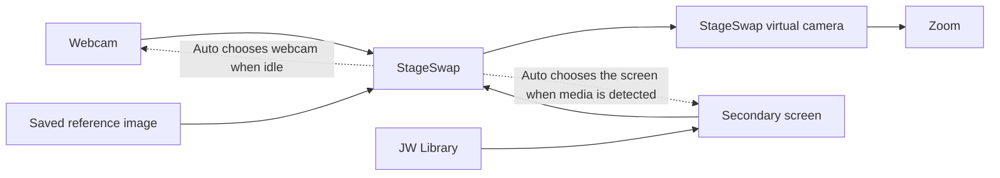

## Before you start

StageSwap requires:

- A 64-bit Windows 11 computer.
- A webcam.
- A secondary screen that JW Library uses for presentations.
- Zoom installed and able to select virtual cameras.
- Permission to approve the administrator prompt when StageSwap first registers or updates its virtual-camera component.

The virtual-camera output is fixed at **1280×720 and 30 fps**. Webcam video is composed to 16:9, with optional centered cropping for non-16:9 cameras. Screen video is aspect-fitted with black letterboxing when necessary.

### Important boundaries

- StageSwap processes webcam and screen frames locally. It does not record or upload them.
- Anything visible on the selected secondary screen can appear in Zoom while Screen or Auto mode is showing that screen.
- StageSwap does not provide audio.
- StageSwap does not start Zoom's native screen-sharing mode.
- StageSwap does not integrate with or control JW Library.
- Webcam unplug/replug, sleep/resume, docking changes, camera contention, and GPU recovery may require selecting the source again or relaunching StageSwap.

## Install and first launch

Download the versioned `StageSwap_win64_vX.Y.Z.exe` file from the official StageSwap releases page. Current releases are unsigned, so Windows may display a security warning. Continue only when the file came from the official release page.

### Install StageSwap or run once

On first launch, StageSwap offers two choices:

- **Install StageSwap** copies the application to a stable per-user location, creates Start Menu and Desktop shortcuts, and enables the managed path used by Start with Windows and upgrades.
- **Run once** launches the downloaded copy without copying it. This is useful for trying StageSwap, but Windows startup is unavailable until the application is installed.

The virtual-camera registration step requires administrator approval. Normal launches and normal use do not require administrator access.

### First-run setup choices

On a new user-data directory, StageSwap opens the full-page guided setup. Choose **Set up later** if the webcam, secondary screen, or JW Library presentation is not ready. You can reopen the guide at any time through **Settings → General → Open guided setup**.

The guide remembers that it was dismissed or completed and does not reopen on every launch.

### Select StageSwap in Zoom

Before the meeting, open Zoom's camera selector and choose **StageSwap**. This is a virtual camera, not the physical webcam. Leave Zoom selected on StageSwap while StageSwap changes the video it publishes.

## Guided setup

The guided setup has five steps. The bottom progress rail shows the current step; completed steps can be revisited. **Back**, the progress nodes, **Set up later**, and keyboard navigation remain available whenever a capture decision is not pending.

### Step 1 — JW Library to Zoom

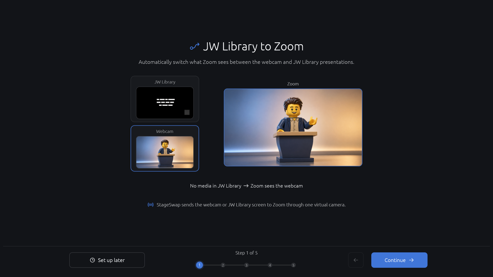

Callouts:

1. The page explains that StageSwap chooses between the webcam and JW Library presentation screen.
2. The first outcome is **No media in JW Library → Zoom sees the webcam**.
3. The second outcome is **Media detected in JW Library → Zoom sees the secondary screen**.
4. The animated example illustrates the reversible transition.
5. **Continue** advances to webcam selection.
6. **Set up later** opens the dashboard without changing the current output mode.

### Step 2 — Choose your webcam

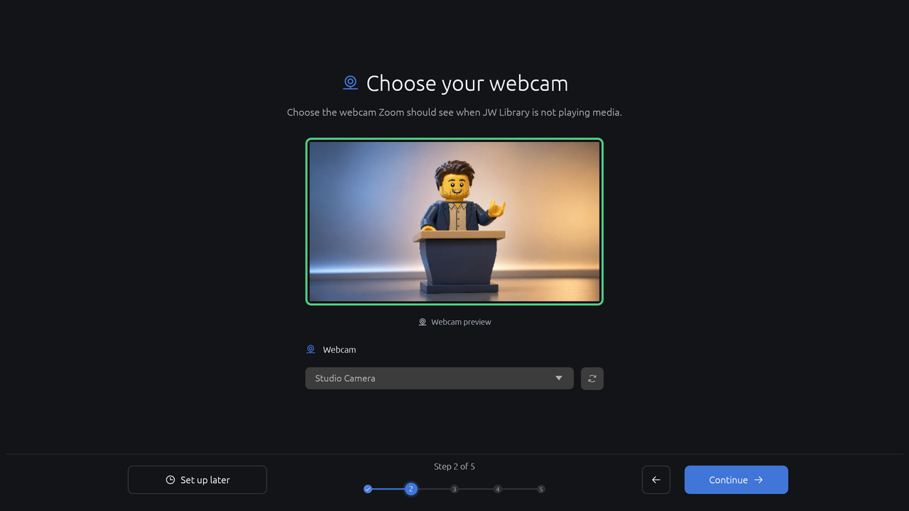

1. Choose the physical webcam that Zoom should see when JW Library is idle.
2. The large preview confirms that StageSwap can receive frames from the selected camera.
3. Use **Refresh webcams** if a newly connected camera is not listed.
4. The camera is not silently substituted if it becomes unavailable; select another camera or restart it in Diagnostics.
5. **Continue** moves to secondary-screen selection.

### Step 3 — Choose the secondary screen

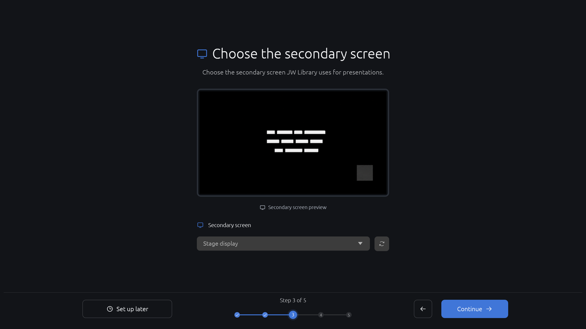

1. Choose the display used by JW Library for presentations.
2. The preview shows the live selected display.
3. Use **Rescan screens** when a display is connected or when the saved display is missing.
4. A display is remembered by its friendly label. If it is not found, StageSwap falls back to the first non-primary display, or to the only display on a single-monitor system.
5. **Continue** moves to reference capture.

### Step 4 — Capture reference image

The reference image is the saved picture of the screen JW Library shows when no media is playing. Show that idle view on the selected screen before capturing.

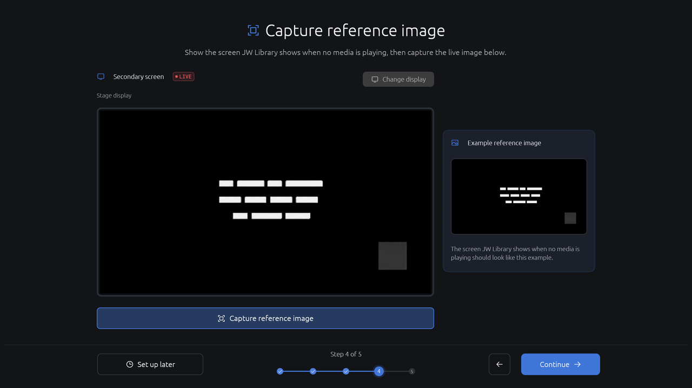

1. Confirm the selected **Secondary screen** and its live status.
2. Check that the live image shows the idle JW Library composition: centered marks and a gray square in a corner.
3. Use **Capture reference image** to freeze a candidate.
4. The example card shows the general appearance to match. It uses unbranded, intentionally illegible marks.
5. **Continue** remains unavailable until a reference image is confirmed.

#### Review before saving

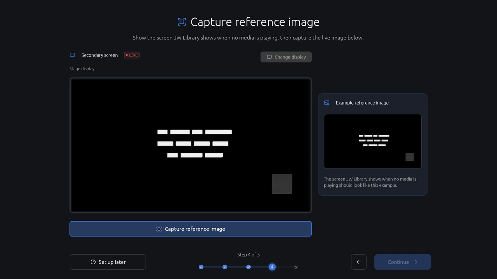

After capture, StageSwap shows the candidate for review. The previous active reference remains in use until the candidate is confirmed.

1. Compare the candidate with the idle JW Library screen.
2. Choose **Cancel** to discard the candidate and keep the previous reference.
3. Choose **Retake** to capture another candidate.
4. Choose **Use this image** to make the candidate active and save it as `reference.png`.
5. While capture or saving is pending, do not advance the setup; navigation is intentionally locked until the decision finishes.

#### Confirmed and unavailable states

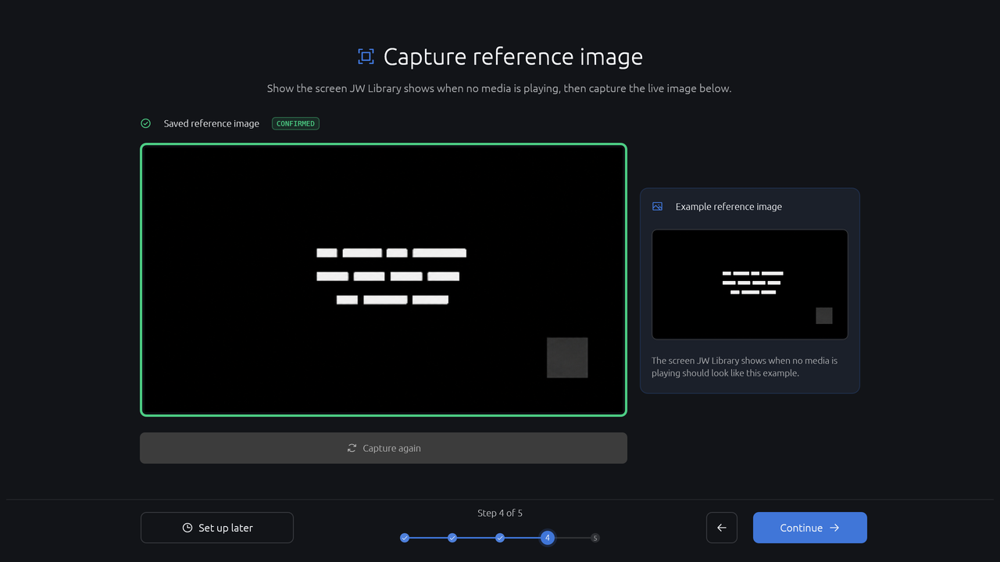

Once saved, the page shows **CONFIRMED** and offers **Capture again**. An existing saved reference opens in this confirmed state.

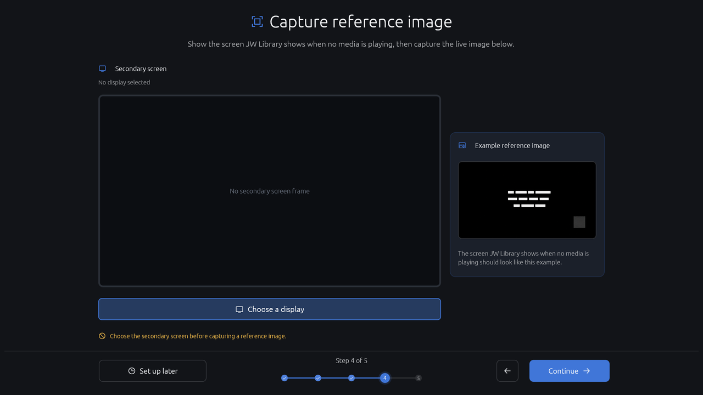

If the selected display is unavailable, choose another display in Step 3 or use Diagnostics. StageSwap does not invent a reference image when it cannot capture the selected display.

### Step 5 — Ready for the meeting

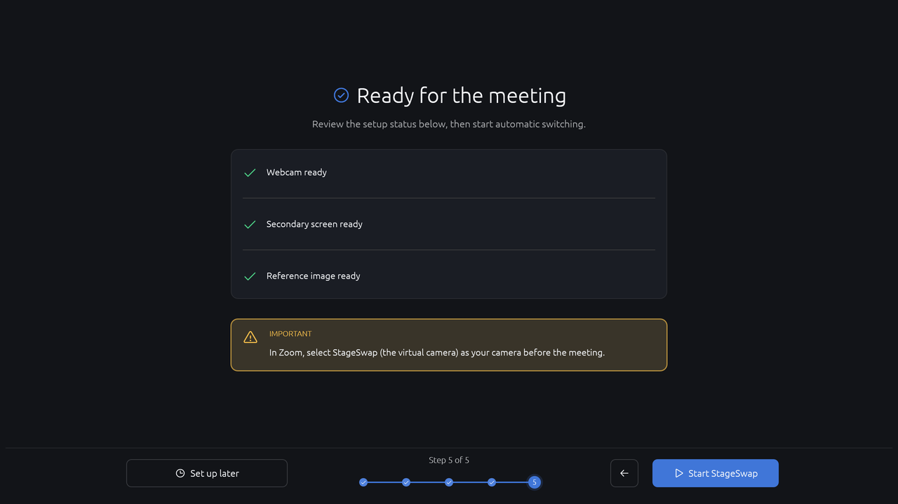

1. **Webcam ready**, **Secondary screen ready**, and **Reference image ready** summarize the three prerequisites.
2. A missing item is reported explicitly. You may continue with incomplete hardware, but Auto mode may not work as expected.
3. The prominent Zoom reminder tells you to select **StageSwap** as the camera before the meeting.
4. **Start StageSwap** selects Automatic mode, starts publishing, and opens the dashboard.
5. **Continue** advances through the guide without starting output.
6. **Set up later** returns to the dashboard or to General Settings, depending on where the guide was opened.

### Keyboard navigation

- **Escape** closes the guide.
- **Left Arrow** goes back.
- **Right Arrow**, **Enter**, and **Space** continue when the next step is available.
- The progress nodes can be selected directly when their destination is allowed.

## The dashboard

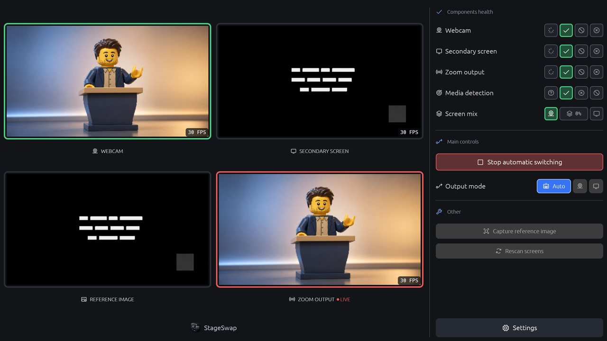

The dashboard is the normal operating view. The left side shows what StageSwap is receiving and publishing. The right side contains status and controls.

### Preview cards

1. **Webcam** shows the selected physical camera. The FPS badge reports the runtime capture rate.
2. **Secondary screen** shows the selected JW Library display.
3. **Reference image** shows the saved idle image used for comparison.
4. **Zoom output** shows the exact composed video currently published to the StageSwap virtual camera. **LIVE** indicates that output is active.

The preview cards are diagnostic views; Zoom receives the Zoom output card, not the individual source cards.

### Components health

The health section reports:

- **Webcam** — whether the selected physical camera is ready.
- **Secondary screen** — whether screen capture is ready.
- **Zoom output** — whether the virtual camera is publishing.
- **Media detection** — whether the reference comparison currently indicates no media, media detected, or an unknown state.
- **Screen mix** — how far a reversible transition has progressed between webcam and screen.

A green check means ready. A pending or unknown state means StageSwap is still starting or checking. A warning or error means use the relevant Settings page or Diagnostics tool.

### Main controls

- **Start automatic switching** starts the runtime using the selected output mode.
- **Stop automatic switching** stops automatic publishing. The virtual camera remains installed and publishes the branded StageSwap off screen: a black frame with the centered StageSwap icon.
- **Output mode → Auto** lets the reference detector choose the source.
- **Output mode → Camera** forces the webcam.
- **Output mode → Screen** forces the secondary screen.
- **Capture reference image** opens the review flow for a new idle reference.
- **Rescan screens** searches connected displays for the saved reference. It does not restart every component.
- **Settings** opens the five Settings pages.

### Output modes

| Mode | What Zoom receives while StageSwap is running |
| --- | --- |
| **Auto** | Webcam when the secondary screen matches the reference; secondary screen when media is detected. |
| **Camera** | The selected webcam continuously. The reference image is ignored. |
| **Screen** | The selected secondary screen continuously. The reference image is ignored. |

Camera and Screen are manual overrides. They remain selected until another mode is chosen and use the same 0.5-second fade as Auto.

## Automatic switching behavior

StageSwap compares the selected screen with the saved reference four times per second.

- Five consecutive matches select the webcam.
- Three consecutive differences select the secondary screen.
- With default settings, a changed display is recognized after about 0.75 seconds.
- A returned reference is confirmed after about 1.25 seconds.
- Each source change uses a reversible 0.5-second fade.

The waiting period prevents a cursor, animation, or single unusual frame from causing a switch. **Required similarity** controls how closely the live screen must resemble the reference.

If no usable reference image exists, Auto mode stays on the webcam. If the webcam is unavailable, StageSwap reports that condition rather than silently substituting another camera. If screen capture becomes unavailable, Auto falls back to the webcam until the screen is available again.

## Meeting-day checklist

Before the meeting:

1. Open StageSwap and confirm the webcam and secondary-screen previews are live.
2. Open JW Library on the selected secondary screen and leave it on the normal no-media view.
3. Confirm the Reference image preview matches that idle view.
4. Open Zoom and select **StageSwap** as the camera.
5. Start automatic switching.
6. Test one media transition before the meeting begins.

During the meeting, use Auto for normal operation. Use Camera or Screen only when you need a direct manual override.

## Settings

Open Settings from the dashboard or the system tray. Settings save automatically; the sidebar shows **Saved**, **Saving…**, or **Couldn’t save**.

The shared Settings sidebar contains:

- The StageSwap logo, product name, and version.
- **Back to dashboard**.
- **General**, **Webcam**, **Secondary screen**, and **Reference image** pages.
- **Diagnostics** at the bottom.
- The autosave status indicator.

### General

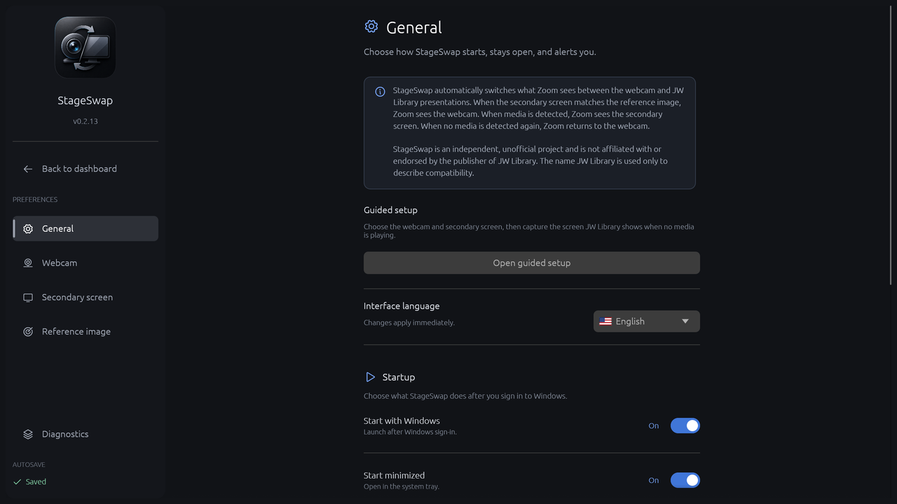

1. The information card explains the JW Library workflow and the independent, unofficial status of StageSwap.
2. **Open guided setup** repeats the five-step setup without changing the current run state until you choose an action.
3. **Interface language** changes the StageSwap interface immediately. Supported languages are English, French, and Spanish.
4. **Start with Windows** launches the installed application after Windows sign-in. It is unavailable in Run once mode until you install StageSwap.
5. **Start minimized** starts StageSwap in the system tray instead of opening the dashboard.
6. **Start automatic switching on launch** starts output automatically after launch. The resulting mode depends on the current output-mode setting.
7. **Keep running in system tray** hides the dashboard when its window is closed while capture and virtual-camera output continue.
8. **Confirm before exit** asks for confirmation before the application fully exits.
9. **Show status notifications** allows Windows notifications when a component needs attention.

The saved result text below the window settings explains whether closing hides the window or exits the application.

### Webcam

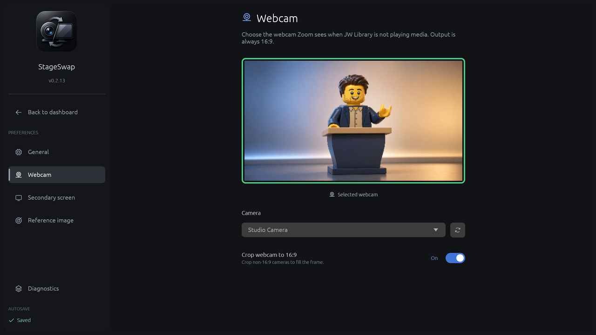

1. The preview shows the currently selected physical webcam.
2. **Camera** selects the webcam that Zoom sees when Auto detects no media.
3. **Refresh camera devices** refreshes the list of available cameras.
4. **Crop webcam to 16:9** crops non-16:9 camera signals to fill the 16:9 output. A native 16:9 input is left unchanged.

If a camera is missing, choose another camera or refresh the list. StageSwap does not continuously rediscover or silently replace a disconnected camera.

### Secondary screen

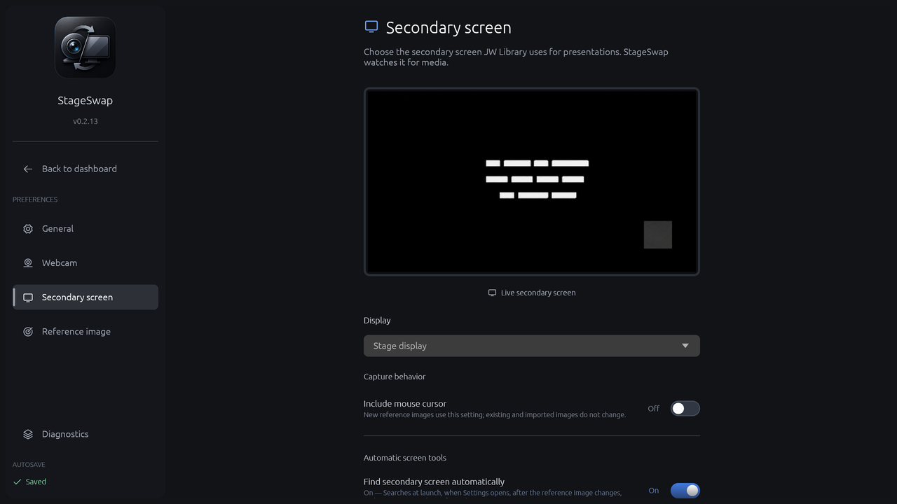

1. The preview shows the selected display.
2. **Display** selects the screen that JW Library uses for presentations.
3. **Include mouse cursor** includes the cursor in newly captured reference images. It does not modify an existing or imported reference.
4. **Find secondary screen automatically** searches connected displays for the saved reference at startup, when Settings opens, after reference changes, and every 30 seconds by default.
5. **Restart capture automatically after a black screen** checks the selected capture at scheduled intervals. Two consecutive nearly-black checks restart screen capture.

Automatic screen discovery and black-screen recovery are independent. Turning off discovery does not turn off explicit **Rescan displays**. Turning off automatic recovery does not stop manual screen-capture restart.

### Reference image

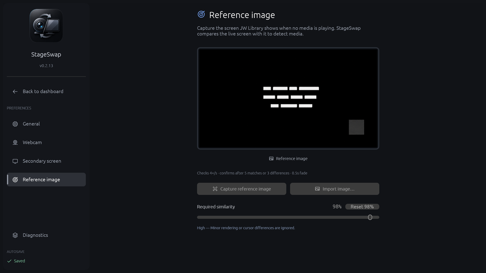

1. The preview shows the saved reference image.
2. **Capture reference image** freezes the current selected-screen frame for review.
3. **Import image…** opens the Windows image picker for a PNG, JPEG, or BMP reference.
4. The timing note explains the 4×/s checks, five-match/three-difference debounce, and 0.5-second fade.
5. **Required similarity** sets how close the live screen must be to the reference. A higher value is stricter; a lower value tolerates more visual variation.
6. **Reset 98%** restores the default similarity threshold.

Capture the no-media screen, not a media slide, video frame, or temporary transition. If Auto changes at the wrong time, recapture the idle reference first, then adjust similarity gradually.

### Diagnostics

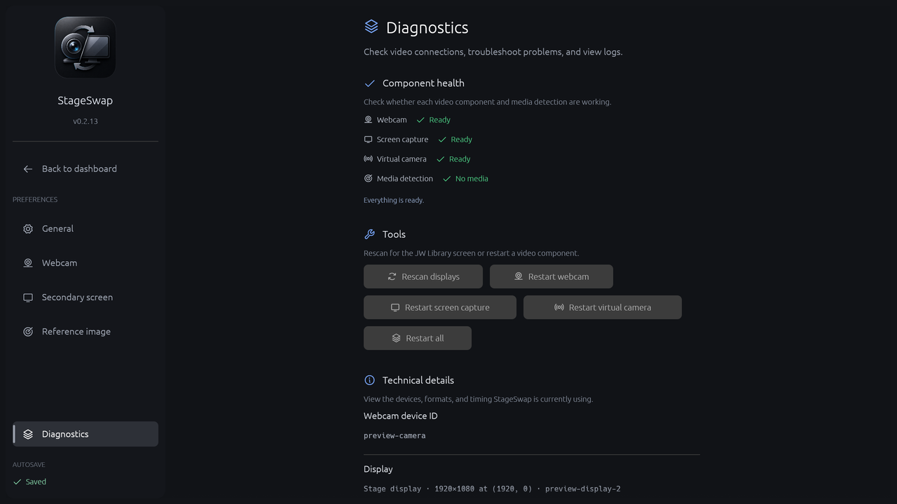

#### Component health

Diagnostics reports the state of:

- Webcam.
- Screen capture.
- Virtual camera.
- Media detection.

The guidance below the statuses explains the next appropriate action.

#### Tools

- **Rescan displays** searches for the saved reference and may change the selected display after confirmation.
- **Restart webcam** restarts the selected physical webcam.
- **Restart screen capture** restarts the selected display capture.
- **Restart virtual camera** restarts the virtual-camera publisher. Zoom may need StageSwap selected again.
- **Restart all** restarts the retained video components together.

#### Technical details

Technical details show the selected webcam identifier, display geometry, current webcam format, output format, transition timing, and detection timing. These values are useful when reporting a problem.

#### Storage and logs

StageSwap stores user data under `%LocalAppData%\StageSwap`:

- `config.json` — current settings.
- `config.backup.json` — the last valid settings backup.
- `reference.png` — the active reference image.
- `logs\` — local JSONL diagnostic logs.

Logs are retained for 14 days. Use **Open folder**, **Export…**, or **Clear…** to manage them. Clearing logs permanently removes the stored diagnostic logs, but new logs continue to be recorded.

## Reference capture and confirmation dialogs

The same capture flow is available from Guided setup, the dashboard, and Reference image Settings.

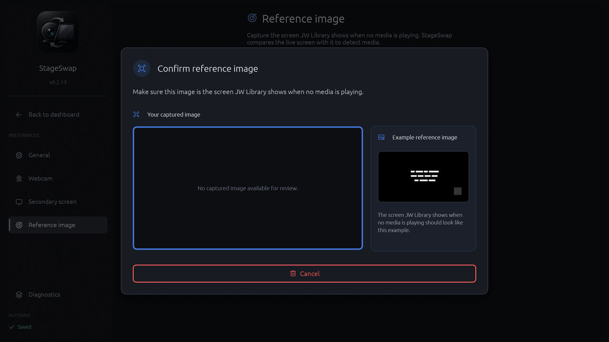

1. **Your captured image** is the candidate under review. The active reference remains unchanged at this point.
2. **Example reference image** shows the expected idle-screen composition.
3. **Cancel** discards the candidate.
4. **Retake** captures another candidate when one exists.
5. **Use this image** confirms the candidate, makes it active, and saves it.

The screenshot above shows the initial capture state before a candidate frame arrives, so its candidate panel is empty and only **Cancel** is available. After capture, the same dialog presents the candidate with **Retake** and **Use this image**.

The review dialog can also be dismissed with Escape or by clicking the backdrop. Dismissal is non-destructive. A saved reference changes only after confirmation succeeds.

When an imported image is accepted, it becomes the active reference using the same validation and display-discovery behavior as a captured image.

## System tray

When **Start minimized** or **Keep running in system tray** is enabled, StageSwap remains available in the Windows notification area.

The tray menu contains:

- **Open StageSwap** — shows and focuses the dashboard.
- **Start automatic switching** or **Stop automatic switching** — toggles runtime publishing.
- **Output mode** — opens **Automatic**, **Webcam only**, and **Screen only** choices.
- **Settings** — shows Settings and focuses the window.
- **Exit** — fully exits StageSwap when confirmed.

Closing the dashboard is not the same as exiting. When close-to-tray is enabled, the window hides while capture and the virtual camera continue. Exiting stops StageSwap publishing; the installed virtual camera remains available and shows the StageSwap off screen until the application starts again.

## Advanced admin configuration

StageSwap includes a hidden per-user admin configuration window for managed setups.

1. Open Settings.
2. Secondary-click the StageSwap logo twice.
3. The Admin configuration window opens.

A normal primary click or one secondary click does not open it.

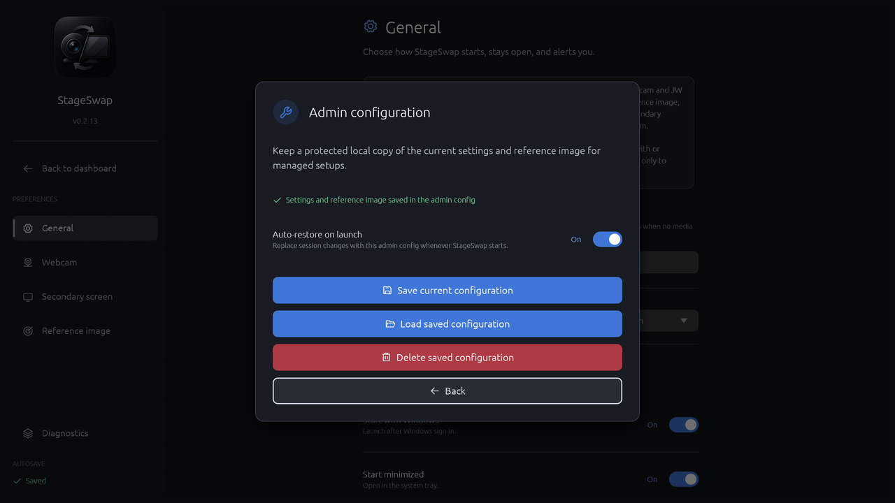

When a saved admin configuration exists:

1. The status line confirms whether settings and a reference image are saved.
2. **Auto-restore on launch** replaces session changes with the saved admin configuration whenever StageSwap starts.
3. **Save current configuration** replaces the protected baseline after confirmation.
4. **Load saved configuration** applies the baseline immediately after confirmation, regardless of the auto-restore setting.
5. **Delete saved configuration** removes the baseline and turns off auto-restore after confirmation.
6. **Back** closes the admin window without changing the working setup.

If no admin configuration exists, only **Save current configuration** and **Back** are shown. Invalid saved admin data fails open: StageSwap keeps the working configuration and displays a warning.

## Optional diagnostic effect

For testing the composed output, click the **Diagnostics** tab five times with the primary mouse button within three seconds. This toggles a session-only disco effect on the UI and final video output.

The effect is not saved, does not change the stopped StageSwap off screen, and is disabled again by repeating the same five-click gesture. It is intentionally separate from the secondary-button double-click used for admin configuration.

## Troubleshooting

| Symptom | What to do |
| --- | --- |
| Zoom does not list StageSwap | Restart the virtual camera in Diagnostics, then reopen Zoom or select StageSwap again. |
| Zoom shows the wrong source | Check the Zoom camera is StageSwap, confirm the dashboard’s Zoom output preview, and verify the selected mode. |
| Auto stays on the webcam | Capture or import a usable reference image. Auto deliberately stays on the webcam when no reference is available. |
| Auto switches at the wrong time | Return JW Library to its no-media view, capture a fresh reference, then adjust Required similarity if needed. |
| The webcam is missing | Refresh the camera list, select the camera again, and restart the webcam. A relaunch may be required after unplug/replug or sleep. |
| The secondary screen is missing | Choose another display or use Rescan displays. StageSwap does not provide general docking or hot-plug recovery. |
| Screen capture is black | Restart screen capture. If enabled, automatic black-screen recovery restarts the selected capture after two scheduled nearly-black checks. |
| A cursor causes a false difference | Capture the reference with the cursor hidden, or enable Include mouse cursor consistently before capturing a new reference. |
| The screen changes too easily | Increase Required similarity and recapture the reference with a clean idle screen. |
| The screen never changes to media | Lower Required similarity slightly and verify the selected display is the one JW Library uses. |
| The app disappeared after closing | Check the system tray. Close-to-tray hides the dashboard while StageSwap keeps running. |
| Settings did not appear to save | Wait for the sidebar to return to Saved. If it shows Couldn’t save, use the displayed warning and retry. |
| A warning remains after a restart | Read the Diagnostics guidance, restart only the affected component, and export logs if help is needed. |

### What StageSwap does not recover automatically

StageSwap intentionally does not continuously rediscover webcams, handle all docking and display-order changes, recreate a removed GPU device, resolve camera contention, or recover every sleep/resume failure. Selecting the source again, restarting the relevant component, or relaunching the application is the supported recovery path for those cases.

## Updates, cleanup, and removal

### Update

Open a newer downloaded build and confirm the replacement. The managed application is updated atomically and existing settings and the reference image are retained. If the older virtual-camera DLL is still in use, the new build uses a content-versioned component so the update can proceed.

### Cleanup without removing the app

From PowerShell in the folder containing the downloaded executable:

```powershell
.\StageSwap_win64_vX.Y.Z.exe --cleanup
```

Cleanup removes StageSwap's startup registration and virtual-camera deployment while keeping the managed application and user data.

### Uninstall

From PowerShell in the folder containing the downloaded executable:

```powershell
.\StageSwap_win64_vX.Y.Z.exe --uninstall
```

Uninstall removes the managed application, shortcuts, startup registration, and virtual camera. Settings, the reference image, and diagnostic logs are retained under `%LocalAppData%\StageSwap`.

StageSwap owns its own deployment and does not remove another virtual-camera product's files, settings, startup values, or registration.

## Privacy and data

Camera frames and selected-display frames are processed locally. StageSwap does not record or upload video. Settings, the reference image, and diagnostic logs are stored locally under `%LocalAppData%\StageSwap`.

The selected secondary screen is treated as video input. If sensitive or unrelated content is visible there while Auto or Screen mode is active, that content can be sent to Zoom through the StageSwap virtual camera.

## Glossary

| Term | Meaning |
| --- | --- |
| **Auto** | Output mode that switches between webcam and secondary screen using the reference comparison. |
| **Camera** | Manual output mode that forces the webcam. The tray calls this Webcam only. |
| **Screen** | Manual output mode that forces the secondary screen. The tray calls this Screen only. |
| **Reference image** | Saved picture of the screen JW Library shows when no media is playing. |
| **Secondary screen** | The display used by JW Library for presentations and watched by StageSwap. |
| **Zoom output** | The final 1280×720 video published by the StageSwap virtual camera. |
| **Virtual camera** | The camera device named StageSwap that Zoom selects. |
| **System tray** | The Windows notification area where StageSwap can continue running while its dashboard is hidden. |
| **Required similarity** | The threshold used to decide whether the live secondary screen resembles the saved reference. |

## Screenshot maintenance

Regenerate the English screenshot set from the repository root with:

```bash
./scripts/capture-user-guide-screenshots.sh
```

The helper uses the deterministic UI preview targets and verifies that every generated image is a 1280×720 PNG. On macOS it builds a temporary application bundle so the native desktop renderer can deliver screenshot events. The generated images belong in `docs/images/user-guide/`.
